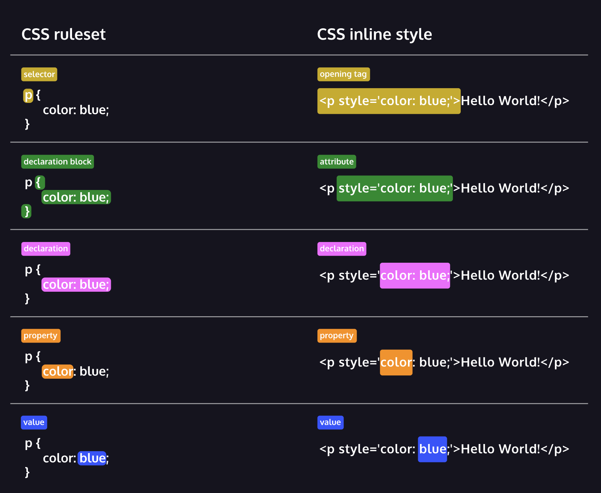

FSE 1 Web Development Foundations
Get started with the foundations. By the end of this section, you'll be able to build a stylized and responsive website with HTML and CSS

FSE 1.1 Web Dev - Fundamentals of HTML
> FSE 1.2 Web Dev - Fundamentals of CSS
FSE 1.3 Web Dev - Developing Websites Locally
FSE 1.4 Web Dev - Deploying Websites
FSE 1.5 Web Dev - Improved Styling with CSS
FSE 1.6 Web Dev - Making a Website Responsive
FSE 1.7 Web Dev - Review, Web Development Foundations
Certification exam, Objective assessments 1 and 2

FSE 1.2 Web Dev - Fundamentals of CSS
Certificate :  Full-Stack Engineer
Course       :  Web Development Foundations
Lesson       :  Fundamentals of CSS
Unit            :  Exercise/Quiz/Material/Project/Forum/Comment
Purpose     :  Learn how to apply styles to HTML documents using CSS

---

FSE 1.2.0. Introduction: Fundamentals of CSS
FSE 1.2.0. Learn CSS: Selectors and Visual Rules
FSE 1.2.1. Setup and Syntax
FSE 1.2.2. Selectors
FSE 1.2.3. Quiz: Setup and Selectors
FSE 1.2.4. Visual Rules
FSE 1.2.5. Quiz: Visual Rules
FSE 1.2.6. Docs: Documentation: CSS
FSE 1.2.7. Project: Healthy Recipes
FSE 1.2.8. Project: Olivia Woodruff Portfolio
FSE 1.2.9. Learn CSS: The Box Model
FSE 1.2.10. The Box Model
FSE 1.2.11. Changing the Box Model
FSE 1.2.12. Quiz: Box Model
FSE 1.2.13. Aritcle: The Box Model in DevTools
FSE 1.2.14. Video: The Box Model in DevTools
FSE 1.2.15: Project: The Box Model: Davie's Burgers
FSE 1.2.16. Learn CSS: Display and Positioning
FSE 1.2.17. Review: Fundamentals of CSS

---

###  1.2.0. Learn CSS: Selectors and Visual Rules
#### Introduction: Fundamentals of CSS
In this unit, you will be introduced to the fundamentals of CSS.

The goal of this unit is to introduce you to CSS, one of the languages essential to developing websites. You will learn how to apply styles to HTML documents using CSS.

After this unit, you will be able to:

Understand how CSS is used for web development
Use CSS to add initial styling to your website
Understand the Box Model in CSS
Add positioning using CSS
Read CSS documentation
Learning is social. Whatever you’re working on, be sure to connect with the Codecademy community in the forums. Remember to check in with the community regularly, including for things like asking for code reviews on your project work and providing code reviews to others in the projects category, which can help to reinforce what you’ve learned.

### FSE 1.2.1. Setup and Syntax
#### Learn > Setup and Syntax > CSS Anatomy
3 min

(image shows on hover but not in markdown preview.)


The diagram on the right shows two different methods, or syntaxes, for writing CSS code. The first syntax shows CSS applied as a ruleset, while the second shows it written as an inline style. Two different methods of writing CSS may seem a bit intimidating at first, but it’s not as bad as it looks!

Both methods contain common features in their anatomy. Notice how both syntaxes contain a declaration. Declarations are the core of CSS. They apply a style to the selected element. Here, the \<p> element has been selected in both syntaxes and will be styled to display the text in blue.

Understanding that a declaration is used to style a selected element is key to learning how to style HTML documents with CSS! The terms below explain each of the labels in the diagram on the right.

Ruleset Terms:

Selector—The beginning of the ruleset used to target the element that will be styled.
Declaration Block—The code in-between (and including) the curly braces ({ }) that contains the CSS declaration(s).
Declaration—The group name for a property and value pair that applies a style to the selected element.
Property—The first part of the declaration that signifies what visual characteristic of the element is to be modified.
Value—The second part of the declaration that signifies the value of the property.
Inline Style Terms:

Opening Tag—The start of an HTML element. This is the element that will be styled.
Attribute—The style attribute is used to add CSS inline styles to an HTML element.
Declaration—The group name for a property and value pair that applies a style to the selected element.
Property—The first part of the declaration that signifies what visual characteristic of the element is to be modified.
Value—The second part of the declaration that signifies the value of the property.
Don’t worry about memorizing all of these—you will get acquainted with them more and more as the course progresses! Feel free to come back and use this exercise as a reference later on.

#### Learn > Setup and Syntax > Inline Styles
4 min
Although CSS is a different language than HTML, it’s possible to write CSS code directly within HTML code using inline styles.

To style an HTML element, you can add the style attribute directly to the opening tag. After you add the attribute, you can set it equal to the CSS style(s) you’d like applied to that element.

\<p style='color: red;'>I'm learning to code!</p>

The code in the example above demonstrates how to use inline styling. The paragraph element has a style attribute within its opening tag. Next, the style attribute is set equal to color: red;, which will set the color of the paragraph text to red within the browser.

If you’d like to add more than one style with inline styles, simply keep adding to the style attribute. Make sure to end the styles with a semicolon (\;).

\<p style='color: red; font-size: 20px;'>I'm learning to code!</p>

It’s important to know that inline styles are a quick way of directly styling an HTML element, but are rarely used when creating websites. But you may encounter circumstances where inline styling is necessary, so understanding how it works, and recognizing it in HTML code is good knowledge to have. Soon you’ll learn the proper way to add CSS code!

#### Setup and Syntax > Internal Stylesheet
7 min
As previously stated, inline styles are not the best way to style HTML elements. If you wanted to style, for example, multiple \<h1> elements, you would have to add inline styling to each element manually. In addition, you would also have to maintain the HTML code when additional \<h1> elements are added.

Fortunately, HTML allows you to write CSS code in its own dedicated section with a \<style> element nested inside of the \<head> element. The CSS code inside the \<style> element is often referred to as an internal stylesheet.

An internal stylesheet has certain benefits and use cases over inlines styles, but once again, it’s not best practice (we’ll get there, we promise). Understanding how to use internal stylesheets is nonetheless helpful knowledge to have.

To create an internal stylesheet, a \<style> element must be placed inside of the \<head> element.
```
<head>
  <style>
  </style>
</head>
```
After adding opening and closing \<style> tags in the head section, you can begin writing CSS code.
```
<head>
  <style>
    p {
      color: red;
      font-size: 20px;
    }
  </style>
</head>
```
The CSS code in the example above changes the color of all paragraph text to red and also changes the size of the text to 20 pixels. Note how the syntax of the CSS code matches (for the most part) the syntax you used for inline styling. The main difference is that you can specify which elements to apply the styling.

#### Learn > Setup and Syntax > External Stylesheet
3 min
Developers avoid mixing code by storing HTML and CSS code in separate files (HTML files contain only HTML code, and CSS files contain only CSS code).

You can create an external stylesheet by using the .css file name extension, like so: style.css

With an external stylesheet, you can write all the CSS code needed to style a page without sacrificing the readability and maintainability of your HTML file.

#### Setup and Syntax > Linking the CSS File
4 min
Perfect! We successfully separated structure (HTML) from styling (CSS), but the web page still looks bland. Why?

When HTML and CSS codes are in separate files, the files must be linked. Otherwise, the HTML file won’t be able to locate the CSS code, and the styling will not be applied.

You can use the \<link> element to link HTML and CSS files together. The \<link> element must be placed within the head of the HTML file. It is a self-closing tag and requires the following attributes:

href — like the anchor element, the value of this attribute must be the address, or path, to the CSS file.
rel — this attribute describes the relationship between the HTML file and the CSS file. Because you are linking to a stylesheet, the value should be set to stylesheet.
When linking an HTML file and a CSS file together, the \<link> element will look like the following:

\<link href='https://www.codecademy.com/stylesheets/style.css' rel='stylesheet'>

Note that in the example above, the path to the stylesheet is a URL:

https://www.codecademy.com/stylesheets/style.css

Specifying the path to the stylesheet using a URL is one way of linking a stylesheet.

If the CSS file is stored in the same directory as your HTML file, then you can specify a relative path instead of a URL, like so:

\<link href='./style.css' rel='stylesheet'>

Using a relative path is very common way of linking a stylesheet.

#### Learn > Setup and Syntax > Review
1 min
Great work so far! By understanding how to incorporate CSS code into your HTML file, as well as learning some of the key terms, you’re on your way to creating spectacular websites with HTML and CSS.

Let’s review what you learned so far:

The basic anatomy of CSS syntax written for both inline styles and stylesheets.
Some commonly used CSS terms, such as ruleset, selector, and declaration.
CSS inline styles can be written inside the opening HTML tag using the style attribute.
Inline styles can be used to style HTML, but it is not the best practice.
An internal stylesheet is written using the \<style> element inside the \<head> element of an HTML file.
Internal stylesheets can be used to style HTML but are also not best practice.
An external stylesheet separates CSS code from HTML, by using the .css file extension.
External stylesheets are the best approach when it comes to using HTML and CSS.
External stylesheets are linked to HTML using the \<link> element.
Take this knowledge to the next lesson, where you start learning how to select HTML elements to style!

### FSE 1.2.2. Selectors
#### Learn > Selectors > Type
3 min
Remember that declarations are a fundamental part of CSS because they apply a style to a selected element. But how do you decide which elements will get the style? With a selector.

A selector is used to target the specific HTML element(s) to be styled by the declaration. One selector you may already be familiar with is the type selector. Just like its name suggests, the type selector matches the type of the element in the HTML document.

In the previous lesson, you changed the color of a paragraph element.
```
p {
  color: green;
}
```
This is an instance of using the type selector! The element type is p, which comes from the HTML \<p> element.

Some important notes on the type selector:

The type selector does not include the angle brackets.
Since element types are often referred to by their opening tag name, the type selector is sometimes referred to as the tag name or element selector.

#### Learn > Selectors > Universal
2 min
You learned how the type selector selects all elements of a given type. Well, the universal selector selects all elements of any type.

Targeting all of the elements on the page has a few specific use cases, such as resetting default browser styling, or selecting all children of a parent element. Don’t worry if you don’t understand the use cases right now—we will get to them later on in our Learn CSS journey.

The universal selector uses the * character in the same place where you specified the type selector in a ruleset, like so:
```
* { 
  font-family: Verdana;
}
```
In the code above, every text element on the page will have its font changed to Verdana.

Instructions
Checkpoint 1 Passed
1.
To see how the universal selector targets all elements on a page, copy the rule below and paste it on the first line of style.css.
```
* {
  border: 1px solid red;
}
```
Then, click “Run”.

Since the universal selector targets all elements, every element on the page now has a red border. Not a visually pleasing look, but you can see how all of the elements have been modified.

#### Learn > Selectors > Class
3 min
CSS is not limited to selecting elements by their type. As you know, HTML elements can also have attributes. When working with HTML and CSS a class attribute is one of the most common ways to select an element.

For example, consider the following HTML:

\<p class='brand'>Sole Shoe Company</p>

The paragraph element in the example above has a class attribute within the opening tag of the<p> element. The class attribute is set to 'brand'. To select this element using CSS, we can create a ruleset with a class selector of .brand.
```
.brand {

}
```
To select an HTML element by its class using CSS, a period (.) must be prepended to the class’s name. In the example above, the class is brand, so the CSS selector for it is .brand.

#### Learn > Selectors > Multiple Classes
4 min
We can use CSS to select an HTML element’s class attribute by name. And so far, we’ve selected elements using only one class name per element. If every HTML element had a single class, all the style information for each element would require a new class.

Luckily, it’s possible to add more than one class name to an HTML element’s class attribute.

For instance, perhaps there’s a heading element that needs to be green and bold. You could write two CSS rulesets like so:
```
.green {
  color: green;
}

.bold {
  font-weight: bold;
}
```
Then, you could include both of these classes on one HTML element like this:

\<h1 class='green bold'> ... </h1>

We can add multiple classes to an HTML element’s class attribute by separating them with a space. This enables us to mix and match CSS classes to create many unique styles without writing a custom class for every style combination needed.

#### Learn > Selectors > ID
5 min
Oftentimes it’s important to select a single element with CSS to give it its own unique style. If an HTML element needs to be styled uniquely, we can give it an ID using the id attribute.

\<h1 id='large-title'> ... </h1>

In contrast to class which accepts multiple values, and can be used broadly throughout an HTML document, an element’s id can only have a single value, and only be used once per page.

To select an element’s ID with CSS, we prepend the id name with a number sign (#). For instance, if we wanted to select the HTML element in the example above, it would look like this:
```
#large-title {

}
```
The id name is large-title, therefore the CSS selector for it is #large-title.

#### Learn > Selectors > Attribute
9 min
You may remember that some HTML elements use attributes to add extra detail or functionality to the element. Some familiar attributes may be href and src, but there are many more—including class and id!

The attribute selector can be used to target HTML elements that already contain attributes. Elements of the same type can be targeted differently by their attribute or attribute value. This alleviates the need to add new code, like the class or id attributes.

Attributes can be selected similarly to types, classes, and IDs.
```
[href]{
   color: magenta;
}
```
The most basic syntax is an attribute surrounded by square brackets. In the above example: [href] would target all elements with an href attribute and set the color to magenta.

And it can get more granular from there by adding type and/or attribute values. One way is by using type[attribute*=value]. In short, this code selects an element where the attribute contains any instance of the specified value. Let’s take a look at an example.

\
\

The HTML code above renders two \ elements, each containing a src attribute with a value equaling a link to an image file.
```
img[src*='winter'] {
  height: 50px;
}

img[src*='summer'] {
  height: 100px;
}
```
Now take a look at the above CSS code. The attribute selector is used to target each image individually.

The first ruleset looks for an img element with an attribute of src that contains the string 'winter', and sets the height to 50px.
The second ruleset looks for an img element with an attribute of src that contains the string 'summer', and sets the height to 100px.
Notice how no new HTML markup (like a class or id) needed to be added, and we were still able to modify the styles of each image independently. This is one advantage to using the attribute selector!

To use the attribute selector to select the \<a> element with an href attribute value containing ‘florence’, add the following code to style.css:
```
a[href*='florence'] {
  color: lightgreen;
}
```

#### Learn > Selectors > Pseudo-class
5 min
You may have observed how the appearance of certain elements can change, or be in a different state, after certain user interactions. For instance:

When you click on an \<input> element, and a blue border is added showing that it is in focus.
When you click on a blue \<a> link to visit to another page, but when you return the link’s text is purple.
When you’re filling out a form and the submit button is grayed out and disabled. But when all of the fields have been filled out, the button has color showing that it’s active.
These are all examples of pseudo-class selectors in action! In fact, :focus, :visited, :disabled, and :active are all pseudo-classes. Factors such as user interaction, site navigation, and position in the document tree can all give elements a different state with pseudo-class.

A pseudo-class can be attached to any selector. It is always written as a colon : followed by a name. For example p:hover.
```
p:hover {
  background-color: lime;
}
```
In the above code, whenever the mouse hovers over a paragraph element, that paragraph will have a lime-colored background.

Note: css selectors and color changing text will be relevant in upcoming project
```
 a:hover {
  color:darkorange;
}
```

#### Learn > Selectors Classes and IDs
10 min
CSS can select HTML elements by their type, class, and ID. CSS classes and IDs have different purposes, which can affect which one you use to style HTML elements.

CSS classes are meant to be reused over many elements. By writing CSS classes, you can style elements in a variety of ways by mixing classes. For instance, imagine a page with two headlines. One headline needs to be bold and blue, and the other needs to be bold and green. Instead of writing separate CSS rules for each headline that repeat each other’s code, it’s better to write a .bold CSS rule, a .green CSS rule, and a .blue CSS rule. Then you can give one headline the bold green classes, and the other the bold blue classes.

While classes are meant to be used many times, an ID is meant to style only one element. As you’ll learn in the next exercise, IDs override the styles of types and classes. Since IDs override these styles, they should be used sparingly and only on elements that need to always appear the same.

Learn > Selectors: Specificity
6 min
Specificity is the order by which the browser decides which CSS styles will be displayed. A best practice in CSS is to style elements while using the lowest degree of specificity so that if an element needs a new style, it is easy to override.

> IDs are the most specific selector in CSS, followed by classes, and finally, type.
For example, consider the following HTML and CSS:
```
<h1 class='headline'>Breaking News</h1>

h1 {
  color: red;
}

.headline {
  color: firebrick;
}
```
In the example code above, the color of the heading would be set to firebrick, as the class selector is more specific than the type selector. If an ID attribute (and selector) were added to the code above, the styles within the ID selector’s body would override all other styles for the heading.

Over time, as files grow with code, many elements may have IDs, which can make CSS difficult to edit since a new, more specific style must be created to change the style of an element.

> To make styles easy to edit, it’s best to style with a type selector, if possible. If not, add a class selector. If that is not specific enough, then consider using an ID selector.

#### Learn > Selectors > Chaining
4 min
When writing CSS rules, it’s possible to require an HTML element to have two or more CSS selectors at the same time.

This is done by combining multiple selectors, which we will refer to as chaining. For instance, if there was a special class for \<h1> elements, the CSS would look like below:
```
h1.special {

}
```
The code above would select only the \<h1> elements with a class of special. If a \<p> element also had a class of special, the rule in the example would not style the paragraph.

#### Learn > Selectors > Descendant Combinator
6 min
In addition to chaining selectors to select elements, CSS also supports selecting elements that are nested within other HTML elements, also known as descendants. For instance, consider the following HTML:
```
<ul class='main-list'>
  <li> ... </li>
  <li> ... </li>
  <li> ... </li>
</ul>
```
The nested \<li> elements are descendants of the \<ul> element and can be selected with the descendant combinator like so:
```
.main-list li {

}
```
In the example above, .main-list selects the element with the.main-list class (the \<ul> element). The descendant \<li>‘s are selected by adding li to the selector, separated by a space. This results in .main-list li as the final selector.

Selecting elements in this way can make our selectors even more specific by making sure they appear in the context we expect.

### Learn > Selectors > Chaining and Specificity
5 min
In the last exercise, instead of selecting all <h5> elements, you selected only the <h5> elements nested inside the .description elements. This CSS selector was more specific than writing only h5. Adding more than one tag, class, or ID to a CSS selector increases the specificity of the CSS selector.

For instance, consider the following CSS:
```
p {
  color: blue;
}

.main p {
  color: red;
}
```
Both of these CSS rules define what a \<p> element should look like. Since .main p has a class and a p type as its selector, only the \<p> elements inside the .main element will appear red. This occurs despite there being another more general rule that states \<p> elements should be blue.

"The elements stay gold because there is a more specific selector for \<h4> elements you wrote in the last step. Because of the more specific CSS selector (li h4), the more general selector of h4 will not take hold."

#### Learn > Selectors > Multiple Selectors
2 min
In order to make CSS more concise, it’s possible to add CSS styles to multiple CSS selectors all at once. This prevents writing repetitive code.

For instance, the following code has repetitive style attributes:
```
h1 {
  font-family: Georgia;
}

.menu {
  font-family: Georgia;
}
```
Instead of writing font-family: Georgia twice for two selectors, we can separate the selectors by a comma to apply the same style to both, like this:
```
h1, 
.menu {
  font-family: Georgia;
}
```
By separating the CSS selectors with a comma, both the \<h1> elements and the elements with the menu class will receive the font-family: Georgia styling.

#### Learn > Selectors: Review
1 min
Throughout this lesson, you learned how to select HTML elements with CSS and apply styles to them. Let’s review what you learned:

* CSS can select HTML elements by type, class, ID, and attribute.
* All elements can be selected using the universal selector.
* An element can have different states using the pseudo-class selector.
* Multiple CSS classes can be applied to one HTML element.
* Classes can be reusable, while IDs can only be used once.
* IDs are more specific than classes, and classes are more specific than type. That means IDs will override any styles from a class, and classes will override any styles from a type selector.
* Multiple selectors can be chained together to select an element. This raises the specificity but can be necessary.
* Nested elements can be selected by separating selectors with a space.
* Multiple unrelated selectors can receive the same styles by separating the selector names with commas.
Great work this lesson. With this knowledge, you’ll be able to use CSS to change the look and feel of websites to make them look great!

Both inline styles and \<style> can be used together, but \<style> should include CSS code, not HTML elements.

### FSE 1.2.3 Quiz: Setup and Selectors
To change the color of an HTML paragraph element to red using inline styling, you can use the style attribute directly within the \<p> tag. Here’s an example:
\<p style="color: red;">This is a red paragraph.</p>

### FSE 1.2.4. Visual Rules
#### Learn > Visual Rules > Introduction To Visual Rules
1 min
The purpose of CSS is to add style to web page, and each element on the page can have many style properties. Some of the basic properties relate to the size, style, and color of the element. In this lesson, you’ll learn some fundamental CSS visual rules that you can use to start styling web page elements!

#### Learn > Visual Rules > Font Family
5 min
If you’ve ever used word processing software, like Microsoft Word or Google Docs, chances are that you probably also used a feature that allowed you to change the font you were typing in. Font refers to the technical term typeface, or font family.

To change the typeface of text on your web page, you can use the font-family property.
```
h1 {
  font-family: Garamond;
}
```
In the example above, the font family for all main heading elements has been set to Garamond.

When setting typefaces on a web page, keep the following points in mind:

The font specified must be installed on the user’s computer or downloaded with the site.
Web safe fonts are a group of fonts supported across most browsers and operating systems.
Unless you are using web safe fonts, the font you choose may not appear the same between all browsers and operating systems.
When the name of a typeface consists of more than one word, it’s a best practice to enclose the typeface’s name in quotes, like so:
```
h1 {
  font-family: 'Courier New';
}
```
You’ll take a deeper look into typography in a later lesson!

> To toggle Tab focus mode press Shift + Ctrl + M. For a list of all functions and keyboard shortcuts press fn + f1. To get an explanation of any highlighted code, press Cmd + Shift + X.

> Tab Moves Focus is a feature implemented for accessibility reasons, and allows keyboard users to navigate VSCode's various UI elements by using the Tab key to move onto the next item (Shift + Tab goes to the last item)

#### Learn > Visual Rules > Font Size
1 min
Changing the typeface isn’t the only way to customize the text. Oftentimes, different sections of a web page are highlighted by modifying the font size.

To change the size of text on your web page, you can use the font-size property.
```
p {
  font-size: 18px;
}
```
In the example above, the font-size of all paragraphs was set to 18px. px means pixels, which is one way to measure font size.

#### Learn > Visual Rules > Font Weight
1 min
In CSS, the font-weight property controls how bold or thin text appears.
```
p {
  font-weight: bold;
}
```
In the example above, all paragraphs on the web page would appear bolded.

The font-weight property has another value: normal. Why does it exist?

If we wanted all text on a web page to appear bolded, we could select all text elements and change their font weight to bold. If a certain section of text was required to appear normal, however, we could set the font weight of that particular element to normal, essentially shutting off bold for that element.

MDN:
font-weight: 400; /* normal */
font-weight: 700; /* bold */

#### Learn > Visual Rules > Text Align
2 min
No matter how much styling is applied to text (typeface, size, weight, etc.), the text always appears on the left side of the container in which it resides.

To align text we can use the text-align property. The text-align property will align text to the element that holds it, otherwise known as its parent.
```
h1 {
  text-align: right;
}
```
The text-align property can be set to one of the following commonly used values:

left — aligns text to the left side of its parent element, which in this case is the browser.
center — centers text inside of its parent element.
right — aligns text to the right side of its parent element.
justify— spaces out text in order to align with the right and left side of the parent element.

Question
Can the text align-property only be used to align text or can we use it to align other content as well?

Answer
The text-align property is used to align the inner content of a block element. This means that in addition to aligning text, it can also be used to align inline or inline-block elements within a containing div.

#### Learn > Visual Rules: Color and Background Color
3 min
Before discussing the specifics of color, it’s important to make two distinctions about color. Color can affect the following design aspects:

Foreground color
Background color
Foreground color is the color that an element appears in. For example, when a heading is styled to appear green, the foreground color of the heading has been styled. Conversely, when a heading is styled so that its background appears yellow, the background color of the heading has been styled.

In CSS, these two design aspects can be styled with the following two properties:

color: this property styles an element’s foreground color
background-color: this property styles an element’s background color
```
h1 {
  color: red;
  background-color: blue;
}
```
In the example above, the text of the heading will appear in red, and the background of the heading will appear blue.

#### Learn > Visual Rules > Opacity
2 min
Opacity is the measure of how NOT transparent (or opaque) an element is. It’s measured from 0 to 1, with 1 representing 100%, or fully visible and opaque, and 0 representing 0%, or fully invisible.

Opacity can be used to make elements fade into others for a nice overlay effect. To adjust the opacity of an element, the syntax looks like this:
```
.overlay {
  opacity: 0.5;
}
```
In the example above, the .overlay element would be 50% visible, letting whatever is positioned behind it show through.

Note: this will likely be used in an upcoming project

#### Learn > Visual Rules > Background Image
3 min
CSS has the ability to change the background of an element. One option is to make the background of an element an image. This is done through the CSS property background-image. Its syntax looks like this:
```
.main-banner {
  background-image: url('https://www.example.com/image.jpg');
}
```
The background-image property will set the element’s background to display an image.
The value provided to background-image is a url. The url should be a URL to an image. The url can be a file within your project, or it can be a link to an external site. To link to an image inside an existing project, you must provide a relative file path. If there was an image folder in the project, with an image named mountains.jpg, the relative file path would look like below:
```
.main-banner {
  background-image: url('images/mountains.jpg');
}
```
#### Learn > Visual Rules > Important
3 min
!important can be applied to specific declarations, instead of full rules. It will override any style no matter how specific it is. As a result, it should almost never be used. Once !important is used, it is very hard to override.

The syntax of !important in CSS looks like this:
```
p {
  color: blue !important;
}

.main p {
  color: red;
}
```
> Since !important is used on the p selector’s color attribute, all p elements will appear blue, even though there is a more specific .main p selector that sets the color attribute to red.

One justification for using !important is when working with multiple stylesheets. For example, if we are using the Bootstrap CSS framework and want to override the styles for one specific HTML element, we can use the !important property.

#### Learn > Visual Rules > Review Visual Rules
<1 min
Incredible work! You used CSS to alter text and images on a website. Throughout this lesson, you learned concepts including:

* The font-family property defines the typeface of an element.
font-size controls the size of text displayed.
font-weight defines how thin or thick text is displayed.
* The text-align property places text in the left, right, or center of its parent container.
* Text can have two different color attributes: color and background-color. color defines the color of the text, while background-color defines the color behind the text.
* CSS can make an element transparent with the opacity property.
* CSS can also set the background of an element to an image with the background-image property.
* The !important flag will override any style, however it should almost never be used, as it is extremely difficult to override.

### FSE 1.2.7. Project: Healthy Recipes

Take a closer look at your CSS selector to ensure it selects the correct elements. Remember that when combining a tag and a class, there should not be a space between them. 

### FSE 1.2.8. Project: Olivia Woodruff Portfolio
### FSE 1.2.10. The Box Model
#### Learn > The Box Model > Introduction to the Box Model
2 min
Browsers load HTML elements with default position values. This often leads to an unexpected and unwanted user experience while limiting the views you can create. In this lesson, you will learn about the box model, an important concept to understand how elements are positioned and displayed on a website.

If you have used HTML and CSS, you have unknowingly seen aspects of the box model. For example, if you have set the background color of an element, you may have noticed that the color was applied not only to the area directly behind the element but also to the area to the right of the element. Also, if you have aligned text, you know it is aligned relative to something. What is that something?

All elements on a web page are interpreted by the browser as “living” inside of a box. This is what is meant by the box model.

For example, when you change the background color of an element, you change the background color of its entire box.

In this lesson, you’ll learn about the following aspects of the box model:

* The dimensions of an element’s box.
* The borders of an element’s box.
* The paddings of an element’s box.
* The margins of an element’s box.

#### Learn > The Box Model: The Box Model
1 min
The box model comprises the set of properties that define parts of an element that take up space on a web page. The model includes the content area’s size (width and height) and the element’s padding, border, and margin. The properties include:

1. width and height: The width and height of the content area.
2. padding: The amount of space between the content area and the border.
3. border: The thickness and style of the border surrounding the content area and padding.
4. margin: The amount of space between the border and the outside edge of the element.

#### Learn > The Box Model: Height and Width
4 min
An element’s content has two dimensions: a height and a width. By default, the dimensions of an HTML box are set to hold the raw contents of the box.

The CSS height and width properties can be used to modify these default dimensions.
```
p {
  height: 80px;
  width: 240px;
}
```
In this example, the height and width of paragraph elements are set to 80 pixels and 240 pixels, respectively — the px in the code above stands for pixels.

Pixels allow you to set the exact size of an element’s box (width and height). When the width and height of an element are set in pixels, it will be the same size on all devices — an element that fills a laptop screen will overflow a mobile screen.

> The overflow property has three main values, the default is visible which will allow us to see the container inside of the parent element (also called child) spill over or overflow from the container, the second value is hidden which will hide the part of the child element that would not fit inside the parent, and the third is scroll, which will allow us to have the overflowing text hidden, and it will give us a scroll bar to be able to see it.

> Is there an alternative to make a page look great on all devices? 
> Yes, and we can expect it to come up, shortly. It’s called responsive design and uses what are called media queries to set out special rules for a range of device widths.
> Another term you might run across is adaptive design which is not the same thing but similar in nature. It focuses on using one layout that can expand and collapse as the device width increases and decreases.

#### Learn > The Box Model > Borders
5 min
A border is a line that surrounds an element, like a frame around a painting. Borders can be set with a specific width, style, and color:

width—The thickness of the border. A border’s thickness can be set in pixels or with one of the following keywords: thin, medium, or thick.
style—The design of the border. Web browsers can render any of 10 different styles. Some of these styles include: none, dotted, and solid.
color—The color of the border. Web browsers can render colors using a few different formats, including 140 built-in color keywords.
```
p {
  border: 3px solid coral;
}
```
In the example above, the border has a width of 3 pixels, a style of solid, and a color of coral. All three properties are set in one line of code.

> The default border is medium none color, where color is the current color of the element. If width, style, or color are not set in the CSS file, the web browser assigns the default value for that property--including border width.
```
p.content-header {
  height: 80px;
  width: 240px;
  border: solid coral;
}
```
In this example, the border style is set to solid and the color is set to coral. The width is not set, so it defaults to medium.

#### Learn > The Box Model: Border Radius
3 min
Ever since we revealed the borders of boxes, you may have noticed that the borders highlight the true shape of an element’s box: square. Thanks to CSS, a border doesn’t have to be square.

You can modify the corners of an element’s border box with the border-radius property.
```
div.container {
  border: 3px solid blue;
  border-radius: 5px;
}
```
The code in the example above will set all four corners of the border to a radius of 5 pixels (i.e. the same curvature that a circle with a radius of 5 pixels would have).

You can create a border that is a perfect circle by first creating an element with the same width and height, and then setting the radius equal to half the width of the box, which is 50%.
```
div.container {
  height: 60px;
  width: 60px;
  border: 3px solid blue;
  border-radius: 50%;
}
```
The code in the example above creates a \<div> that is a perfect circle.

> Having 100% on border-radius should give you a perfect circle, that is correct, only if the element’s height and width are the same. That is, you need a square element to have a circle border. As well, if your element does not have specific measurements it is at the mercy of the size of the container and its own content, and therefore you will need to adjust its measurements if your goal is to have a circle border.

#### Learn > The Box Model > Padding
6 min
The space between the contents of a box and the borders of a box is known as padding. Padding is like the space between a picture and the frame surrounding it. In CSS, you can modify this space with the padding property.
```
p.content-header {
  border: 3px solid coral;
  padding: 10px;
}
```
The code in this example puts 10 pixels of space between the content of the paragraph (the text) and the borders, on all four sides.

The padding property is often used to expand the background color and make the content look less cramped.

If you want to be more specific about the amount of padding on each side of a box’s content, you can use the following properties:
```
padding-top
padding-right
padding-bottom
padding-left
```
Each property affects the padding on only one side of the box’s content, giving you more flexibility in customization.
```
p.content-header {
  border: 3px solid fuchsia;
  padding-bottom: 10px;
}
```
In the example above, only the bottom side of the paragraph’s content will have a padding of 10 pixels.

> Main difference between padding and margin is that margin will create the space outside of the element, while padding constricts space inwards.

Note: I had a could not press Next button here because my code differed in how I entered the solution
/ padding: 20px 30px;
vs
```
padding-top: 20px;
padding-bottom: 20px;
padding-left: 30px;
padding-right: 30px;
```
#### Learn > The Box Model > Padding Shorthand
5 min
Another implementation of the padding property lets you specify exactly how much padding there should be on each side of the content in a single declaration. A declaration that uses multiple properties as values is known as a shorthand property.

Padding shorthand lets you specify all of the padding properties as values on a single line:
```
padding-top
padding-right
padding-bottom
padding-left
```
You can specify these properties in a few different ways:

4 Values
```
p.content-header {
  padding: 6px 11px 4px 9px;
}
```
In the example above, the four values 6px 11px 4px 9px correspond to the amount of padding on each side, in a clockwise rotation. In order, it specifies the padding-top value (6px), the padding-right value (11px), the padding-bottom value (4px), and the padding-left value (9px) of the content.

3 Values
```
p.content-header {
  padding: 5px 10px 20px;
}
```
If the left and right sides of the content can be equal, the padding shorthand property allows for 3 values to be specified. The first value sets the padding-top value (5px), the second value sets the padding-left and padding-right values (10px), and the third value sets the padding-bottom value (20px).

2 Values
```
p.content-header {
  padding: 5px 10px;
}
```
And finally, if the top and bottom sides can be equal, and the left and right sides can be equal, you can specify 2 values. The first value sets the padding-top and padding-bottom values (5px), and the second value sets the padding-left and padding-right values (10px).

#### Learn > The Box Model > Margin
4 min
So far you’ve learned about the following components of the box model: content, borders, and padding. The fourth and final component of the box model is margin.

Margin refers to the space directly outside of the box. The margin property is used to specify the size of this space.
```
p {
  border: 1px solid aquamarine;
  margin: 20px;
}
```
The code in the example above will place 20 pixels of space on the outside of the paragraph’s box on all four sides. This means that other HTML elements on the page cannot come within 20 pixels of the paragraph’s border.

If you want to be even more specific about the amount of margin on each side of a box, you can use the following properties:
```
margin-top
margin-right
margin-bottom
margin-left
```
Each property affects the margin on only one side of the box, providing more flexibility in customization.
```
p {
  border: 3px solid DarkSlateGrey;
  margin-right: 15px;
}
```
In the example above, only the right side of the paragraph’s box will have a margin of 15 pixels. It’s common to see margin values used for a specific side of an element.

#### Learn > The Box Model > Margin Shorthand
1 min
What if you don’t want equal margins on all four sides of the box and don’t have time to separate properties for each side? You’re in luck! Margin can be written as a shorthand property as well. The shorthand syntax for margins is the same as padding, so if you’re feeling comfortable with that, skip to the instructions. Otherwise, read on to learn how to use margin shorthand!

Similar to padding shorthand, margin shorthand lets you specify all of the margin properties as values on a single line:
```
margin-top
margin-right
margin-bottom
margin-left
```
You can specify these properties in a few different ways:

4 Values
```
p {
  margin: 6px 10px 5px 12px;
}
```
In the example above, the four values 6px 10px 5px 12px correspond to the thickness of the margin on each side, in a clockwise rotation. In order, it specifies the margin-top value (6px), the margin-right value (10px), the margin-bottom value (5px), and the margin-left value (12px) of the content.

3 Values
(CSS counts 3 values as if the fourth value was the same as the second)
```
p {
  margin: 5px 12px 4px;
}
```
If the left and right sides of the content can be equal, the margin shorthand property allows for 3 values to be specified. The first value sets the margin-top value (5px), the second value sets the margin-left and margin-right values (12px), and the third value sets the margin-bottom value (4px).

2 Values
```
p {
  margin: 20px 10px;
}
```
And finally, if the top and bottom sides can be equal, and the left and right sides can be equal, you can specify 2 values. The first value sets the margin-top and margin-bottom values (20px), and the second value sets the margin-left and margin-right values (10px).

#### Learn > The Box Model > Auto
5 min
The margin property also lets you center content. However, you must follow a few syntax requirements. Take a look at the following example:
```
div.headline {
  width: 400px;
  margin: 0 auto;
}
```
In the example above, margin: 0 auto; will center the divs in their containing elements. The 0 sets the top and bottom margins to 0 pixels. The auto value instructs the browser to adjust the left and right margins until the element is centered within its containing element.

In order to center an element, a width must be set for that element. Otherwise, the width of the div will be automatically set to the full width of its containing element, like the \<body>, for example. It’s not possible to center an element that takes up the full width of the page, since the width of the page can change due to display and/or browser window size.

In the example above, the width of the div is set to 400 pixels, which is less than the width of most screens. This will cause the div to center within a containing element that is greater than 400 pixels wide.

#### Learn > The Box Model > Margin Collapse
3 min
As you have seen, padding is space added inside an element’s border, while margin is space added outside an element’s border. One additional difference is that top and bottom margins, also called vertical margins, collapse, while top and bottom padding does not.

Horizontal margins (left and right), like padding, are always displayed and added together. For example, if two divs with ids #div-one and #div-two, are next to each other, they will be as far apart as the sum of their adjacent margins.
```
#img-one {
  margin-right: 20px;
}

#img-two {
  margin-left: 20px;
}
```
In this example, the space between the #img-one and #img-two borders is 40 pixels. The right margin of #img-one (20px) and the left margin of #img-two (20px) add to make a total margin of 40 pixels.

Unlike horizontal margins, vertical margins do not add. Instead, the larger of the two vertical margins sets the distance between adjacent elements.
```
#img-one {
  margin-bottom: 30px;
}

#img-two {
  margin-top: 20px;
}
```
In this example, the vertical margin between the #img-one and #img-two elements is 30 pixels. Although the sum of the margins is 50 pixels, the margin collapses so the spacing is only dependent on the #img-one bottom margin.

#### Learn > The Box Model > Minimum and Maximum Height and Width
5 min
Because a web page can be viewed through displays of differing screen size, the content on the web page can suffer from those changes in size. To avoid this problem, CSS offers two properties that can limit how narrow or how wide an element’s box can be sized to:

min-width—this property ensures a minimum width of an element’s box.
max-width—this property ensures a maximum width of an element’s box.
```
p {
  min-width: 300px;
  max-width: 600px;
}
```
In the example above, the width of all paragraphs will not shrink below 300 pixels, nor will the width exceed 600 pixels.

Content, like text, can become difficult to read when a browser window is narrowed or expanded. These two properties ensure that content is legible by limiting the minimum and maximum widths of an element.

You can also limit the minimum and maximum height of an element:

min-height — this property ensures a minimum height for an element’s box.
max-height — this property ensures a maximum height of an element’s box.
```
p {
  min-height: 150px;
  max-height: 300px;
}
```
In the example above, the height of all paragraphs will not shrink below 150 pixels and the height will not exceed 300 pixels.

What will happen to the contents of an element’s box if the max-height property is set too low? It’s possible for the content to spill outside of the box, resulting in content that is not legible. You’ll learn how to work around this issue in the next exercise.

#### Learn > The Box Model > Overflow
4 min
All of the components of the box model comprise an element’s size. For example, an image that has the following dimensions is 364 pixels wide and 244 pixels tall.

* 300 pixels wide
* 200 pixels tall
* 10 pixels padding on the left and right
* 10 pixels padding on the top and bottom
* 2 pixels border on the left and right
* 2 pixels border on the top and bottom
* 20 pixels margin on the left and right
* 10 pixels margin on the top and bottom

The total dimensions (364px by 244px) are calculated by adding all of the vertical dimensions together and all of the horizontal dimensions together. Sometimes, these components result in an element that is larger than the parent’s containing area.

How can we ensure that we can view all of an element that is larger than its parent’s containing area?

The overflow property controls what happens to content that spills, or overflows, outside its box. The most commonly used values are:

* hidden—when set to this value, any content that overflows will be hidden from view.
* scroll—when set to this value, a scrollbar will be added to the element’s box so that the rest of the content can be viewed by scrolling.
* visible—when set to this value, the overflow content will be displayed outside of the containing element. Note, this is the default value.
```
p {
  overflow: scroll; 
}
```
In the example above, if any of the paragraph content overflows (perhaps a user resizes their browser window), a scrollbar will appear so that users can view the rest of the content.

The overflow property is set on a parent element to instruct a web browser on how to render child elements. For example, if a div’s overflow property is set to scroll, all children of this div will display overflowing content with a scroll bar.

For a more in-depth look at overflow, including additional properties like overflow-x and overflow-y that separate out the horizontal and vertical values, head over to the MDN documentation.

#### Learn > The Box Model > Resetting Defaults
3 min
All major web browsers have a default stylesheet they use in the absence of an external stylesheet. These default stylesheets are known as user agent stylesheets. In this case, the term user agent is a technical term for the browser.

User agent stylesheets often have default CSS rules that set default values for padding and margin. This affects how the browser displays HTML elements, which can make it difficult for a developer to design or style a web page.

Many developers choose to reset these default values so that they can truly work with a clean slate.
```
* {
  margin: 0;
  padding: 0;
}
```
The code in the example above resets the default margin and padding values of all HTML elements. It is often the first CSS rule in an external stylesheet.

Note that both properties are set to 0. When these properties are set to 0, they do not require a unit of measurement.

#### Learn > The Box Model > Visibility
3 min
Elements can be hidden from view with the visibility property.

The visibility property can be set to one of the following values:

* hidden — hides an element.
* visible — displays an element.
* collapse — collapses an element.
```
<ul>
  <li>Explore</li>
  <li>Connect</li>
  <li class="future">Donate</li>
</ul>

.future {
  visibility: hidden;
}
```
In the example above, the list item with a class of future will be hidden from view in the browser.

Keep in mind, however, that users can still view the contents of the list item (e.g., Donate) by viewing the source code in their browser. Furthermore, the web page will only hide the contents of the element. It will still leave an empty space where the element is intended to display.

> Note: What’s the difference between display: none and visibility: hidden? An element with display: none will be completely removed from the web page. An element with visibility: hidden, however, will not be visible on the web page, but the space reserved for it will.

The only advantage of using visibility: hidden; over display: none; will be for layout purposes. If after having the value none on the display property, our web layout changes from what we want it or need it to be, then visibility: hidden; will be our best option. 

#### Learn > The Box Model > Review
1 min
In this lesson, we covered the four properties of the box model: height and width, padding, borders, and margins. Understanding the box model is an important step towards learning more advanced HTML and CSS topics. Let’s take a minute to review what you learned:

* The box model comprises a set of properties used to create space around and between HTML elements.
* The height and width of a content area can be set in pixels or percentages.
* Borders surround the content area and padding of an element. The color, style, and thickness of a border can be set with CSS properties.
* Padding is the space between the content area and the border. It can be set in pixels or percent.
* Margin is the amount of spacing outside of an element’s border.
* Horizontal margins add, so the total space between the borders of adjacent elements is equal to the sum of the right margin of one element and the left margin of the adjacent element.
* Vertical margins collapse, so the space between vertically adjacent elements is equal to the larger margin.
* margin: 0 auto horizontally centers an element inside of its parent content area, if it has a width.
* The overflow property can be set to display, hidden, or scroll, and dictates how HTML will render content that overflows its parent’s content area.
* The visibility property can hide or show elements.
Instructions
Make some adjustments to the code in the code editor. See if you can improve the appearance of the page by changing the following properties:

* width
* height
* padding
* border
* margin
* overflow

### FSE 1.2.11. Changing the Box Model
#### Learn > Changing the Box Model > Why Change the Box Model?
1 min
The last lesson focused on the most important aspects of the box model: box dimensions, borders, padding, and margin.

The box model, however, has an awkward limitation regarding box dimensions. This limitation is best illustrated with an example.
```
<h1>Hello World</h1>

h1 {
  border: 1px solid black;
  height: 200px;
  width: 300px;
  padding: 10px;
}
```
In the example above, a heading element’s box has solid, black, 1 pixel thick borders. The height of the box is 200 pixels, while the width of the box is 300 pixels. A padding of 10 pixels has also been set on all four sides of the box’s content.

Unfortunately, under the current box model, the border thickness and the padding will affect the dimensions of the box.

The 10 pixels of padding increases the height of the box to 220 pixels and the width to 320 pixels. Next, the 1-pixel thick border increases the height to 222 pixels and the width to 322 pixels.

Under this box model, the border thickness and padding are added to the overall dimensions of the box. This makes it difficult to accurately size a box. Over time, this can also make all of a web page’s content difficult to position and manage.

In this brief lesson, you’ll learn how to use a different technique that avoids this problem altogether.

#### Learn > Changing the Box Model > Box Model > Content-Box
1 min
Many properties in CSS have a default value and don’t have to be explicitly set in the stylesheet.

For example, the default font-weight of text is normal, but this property-value pair is not typically specified in a stylesheet.

The same can be said about the box model that browsers assume. In CSS, the box-sizing property controls the type of box model the browser should use when interpreting a web page.

The default value of this property is content-box. This is the same box model that is affected by border thickness and padding.

#### Learn > Changing the Box Model > Box Model > Border-Box
2 min
Fortunately, we can reset the entire box model and specify a new one: border-box.
```
* {
  box-sizing: border-box;
}
```
The code in the example above resets the box model to border-box for all HTML elements. This new box model avoids the dimensional issues that exist in the former box model you learned about.

In this box model, the height and width of the box will remain fixed. The border thickness and padding will be included inside of the box, which means the overall dimensions of the box do not change.

\<h1>Hello World</h1>
Use the following code to switch to the new box model.
```
* {
  box-sizing: border-box;
}

h1 {
  border: 1px dashed #4f768e;
  height: 150px;
  width: 200px;
  padding: 20px;
}
```
In the example above, the height of the box would remain at 150 pixels and the width would remain at 200 pixels. The border thickness and padding would remain entirely inside of the box.

#### Learn > Changing the Box Model > Review: Changing the Box Model
<1 min
In this lesson, you learned about an important limitation of the default box model: box dimensions are affected by border thickness and padding.

Let’s review what you learned:

1. In the default box model, box dimensions are affected by border thickness and padding.
2. The box-sizing property controls the box model used by the browser.
3. The default value of the box-sizing property is content-box.
4. The value for the new box model is border-box.
5. The border-box model is not affected by border thickness or padding.

### 1.2.12. Quiz: Box Model

The vertical margins of these two elements will not add together but will collapse to the larger value of the two.

Which of the following CSS properties controls the size of an element’s content?
border and padding are added to the width and height of the content itself.
correct answer height and width

### FSE 1.2.13. Aritcle: The Box Model in DevTools
#### The Box Model in DevTools > View and edit an HTML element’s box using Chrome DevTools

Introduction
All HTML elements are boxes made up of four components: a content container, padding, border, and margin. In our Box Model lesson we introduce these four properties and use them to position elements on a website. If you have not taken this lesson, we recommend you do so now, before continuing.

In this article, we will introduce how Google Chrome’s DevTools can be used to view the box around each element on a web page.
(Note: ad hoc headings only for this page)
##### 1. View Box Model Dimensions with DevTools
You can use Google Chrome’s DevTools to view the box around every element on a web page. There are a few different ways to open DevTools, depending on your platform:

Mac
* Command + Alt + I
* View > Developer > Developer Tools
* Chrome 3 dot menu ⋮ > More Tools > Developer Tools

Elements Tab

In this tab you can view all of the elements on the current page. From this view, you can select the element of interest, which will open a new column on the right side of DevTools. Select the tab labeled Computed on the top of the rightmost column.

Computed Tab

The selected element’s box should appear at the top of the pane. Hovering over each property of the box will cause the property to be highlighted in the web page.

If you know the element you want to inspect, going through all of the steps listed above is unnecessary. Instead, you can right click the element you want to observe and select the Inspect button. This will display DevTools on the right side of the browser with the element selected in the Elements tab. To view the element’s box, you can select the Computed tab.

If you’d like some more info or a refresher on how to use Google Dev Tools, take a look at this video.

Exercise I: View a Website’s Box Model Dimensions

Complete the following steps within the current web browser view.

1. In a new tab navigate to the Codecademy Wikipedia page.
2. Right click (or Ctrl and click simultaneously) the Contents navigation box displayed in the image below:

1. Select Inspect.
2. Select the Computed tab at the top of the rightmost column.
3. Hover over the different properties of the logo’s box. The corresponding space on the web page should be highlighted when you do this.

(Note: ad hoc headings only for this page)
##### 2. Modify Box Dimensions
Now that you know how to view the box of an element we’ll modify the box’s values with DevTools.

To modify the values of the box double click the property value, assign it a new number, and press enter. You can also adjust the value incrementally by double clicking the value and using the up or down arrow keys.

Selecting Values

Note: If you inspect an element and find that the border is set to -, adding a numerical value will not make a border appear. The border color, style, and width must be set in the CSS document in order to see the border.

Exercise II: Modify a Website’s Box Model Dimensions

Pick up where you left off in Exercise 1.

1. Double click the top padding of the element.
2. Use the up and down arrows to adjust the element’s padding. Observe how the appearance changes on the web page.
3. Change the left margin to 200. Observe how the element’s appearance changes.

Remember the changes you make in DevTools are not saved. If you are using DevTools to make adjustments to a personal project, make sure to adjust values in the HTML and CSS documents.

### FSE 1.2.14. Video: The Box Model in DevTools

Metrics pane
To add red border to all elements:
Go into Styles pane, select any HTML, text, etc, then in the metrics Styles pane type + to add a rule, then adde a rule:
```
* { border: 1px dotted red !important;
}
```
Usually, CSS rules that override default browser styling are put in a separate stylesheet called a reset style sheet, maybe reset.css?

### FSE 1.2.15: Project: The Box Model: Davie's Burgers

Objective
Web Development Foundations
The Box Model: Davie's Burgers
In this project, you will follow step-by-step instructions to fix a fictional restaurant’s website. All of the HTML and most of the CSS is intact, but the box model properties have yet to be set. You’ll use knowledge of height, width, padding, border, and margin to complete this project.

The website’s existing index.html and style.css files are displayed in the text editor to the right. As you work, use both to see which elements you are selecting and styling. Most of the elements that you’ll need to add styles for already have rule sets in style.css to which you can add additional declarations.

To center img:
margin: auto;

Note: style.css has classes nicely laid out including  selectors with combinators
Note: the stylesheet is read from top to bottom (cascade)

### FSE 1.2.16. Learn CSS: Display and Positioning

#### Learn > Display and Positioning > Flow of HTML
1 min
A browser will render the elements of an HTML document that has no CSS from left to right, top to bottom, in the same order as they exist in the document. This is called the flow of elements in HTML.

In addition to the properties that it provides to style HTML elements, CSS includes properties that change how a browser positions elements. These properties specify where an element is located on a page, if the element can share lines with other elements, and other related attributes.

In this lesson, you will learn five properties for adjusting the position of HTML elements in the browser:
* position
* display
* z-index
* float
* clear

Each of these properties will allow us to position and view elements on a web page. They can be used in conjunction with any other styling properties you may know.

#### Learn > Display and Positioning > Position
4 min
Take a look at the block-level elements in the image below:

Diagram of block-level elements

Block-level elements like these boxes create a block the full width of their parent elements, and they prevent other elements from appearing in the same horizontal space.

Notice the block-level elements in the image above take up their own line of space and therefore don’t overlap each other. In the browser to the right, you can see block-level elements also consistently appear on the left side of the browser. This is the default position for block-level elements.

The default position of an element can be changed by setting its position property. The position property can take one of five values:

* static - the default value (it does not need to be specified)
* relative
* absolute
* fixed
* sticky

In the next few exercises, you’ll learn about the values in the list above. For now, it’s important to understand that if you favor the default position of an HTML element, you don’t need to set its position property.

#### Learn > Display and Positioning > Position > Relative
4 min
One way to modify the default position of an element is by setting its position property to relative.

This value allows you to position an element relative to its default static position on the web page.
```
.green-box {
  background-color: green;
  position: relative;
}
```
Although the code in the example above instructs the browser to expect a relative positioning of the .green-box element, it does not specify where the .green-box element should be positioned on the page. This is done by accompanying the position declaration with one or more of the following offset properties that will move the element away from its default static position:

* top - moves the element down from the top.
* bottom - moves the element up from the bottom.
* left - moves the element away from the left side (to the right).
* right - moves the element away from the right side (to the left).

You can specify values in pixels, ems, or percentages, among others, to dial in exactly how far you need the element to move. It’s also important to note that offset properties will not work if the element’s position property is the default static.
```
.green-box {
  background-color: green;
  position: relative;
  top: 50px;
  left: 120px;
}
```
In the example above, the element of green-box class will be moved down 50 pixels, and to the right 120 pixels, from its default static position. The image below displays the new position of the box.

Diagram of an element with relative position

Offsetting the relative element will not affect the positioning of other elements.

#### Learn > Display and Positioning > Position > Absolute
3 min
Another way of modifying the position of an element is by setting its position to absolute.

When an element’s position is set to absolute, all other elements on the page will ignore the element and act like it is not present on the page. The element will be positioned relative to its closest positioned parent element, while offset properties can be used to determine the final position from there. Take a look at the image below:

Diagram of an element with absolute position, as described in the following paragraph

The “This website is in progress. Please come back later!” text is displaced from its static position at the top left corner of its parent container. It has offset property declarations of top: 300px; and right: 0px;, positioning it 300 pixels down, and 0 pixels from the right side of the page.

#### Learn > Display and Positioning > Position > Fixed
4 min
When an element’s position is set to absolute, as in the last exercise, the element will scroll with the rest of the document when a user scrolls.

We can fix an element to a specific position on the page (regardless of user scrolling) by setting its position to fixed, and accompanying it with the familiar offset properties top, bottom, left, and right.
```
.title {
  position: fixed;
  top: 0px;
  left: 0px;
}
```
In the example above, the .title element will remain fixed to its position no matter where the user scrolls on the page, like in the image below:

Diagram of position fixed

This technique is often used for navigation bars on a web page.

#### Learn > Display and Positioning > Position > Sticky
3 min
Since static and relative positioned elements stay in the normal flow of the document, when a user scrolls the page (or parent element) these elements will scroll too. And since fixed and absolute positioned elements are removed from the document flow, when a user scrolls, these elements will stay at their specified offset position.

The sticky value is another position value that keeps an element in the document flow as the user scrolls, but sticks to a specified position as the page is scrolled further. This is done by using the sticky value along with the familiar offset properties, as well as one new one.
```
.box-bottom {
  background-color: darkgreen;
  position: sticky;
  top: 240px;
}
```
In the example above, the .box-bottom \<div> will remain in its relative position, and scroll as usual. When it reaches 240 pixels from the top, it will stick to that position until it reaches the bottom of its parent container where it will “unstick” and rejoin the flow of the document.

#### Learn > Display and Positioning > Z-Index
3 min
When boxes on a web page have a combination of different positions, the boxes (and therefore, their content) can overlap with each other, making the content difficult to read or consume.
```
.blue-box {
  background-color: blue;
}

.green-box {
  background-color: green;
  position: relative;
  top: -170px;
  left: 170px;
}
```
In the example above, the .green-box element overlaps on top of the .blue-box element.

The z-index property controls how far back or how far forward an element should appear on the web page when elements overlap. This can be thought of as the depth of elements, with deeper elements appearing behind shallower elements.

The z-index property accepts integer values. Depending on their values, the integers instruct the browser on the order in which elements should be layered on the web page.
```
.blue-box {
  background-color: blue;
  position: relative;
  z-index: 1;
}

.green-box {
  background-color: green;
  position: relative;
  top: -170px;
  left: 170px;
}
```
In the example above, we set the .blue-box position to relative and the z-index to 1. We changed position to relative, because the z-index property does not work on static elements. The z-index of 1 moves the .blue-box element forward, because the z-index value has not been explicitly specified for the .green-box element, which means it has a default z-index value of 0. Take a look at the example image below:

Note: "How far back an element appears" and "behind" with "z-index"

#### Learn > Display and Positioning > Inline Display
5 min
Every HTML element has a default display value that dictates if it can share horizontal space with other elements. Some elements fill the entire browser from left to right regardless of the size of their content. Other elements only take up as much horizontal space as their content requires and can be directly next to other elements.

In this lesson, we’ll cover three values for the display property: inline, block, and inline-block.

> The default display for some elements, such as \<em>, \<strong>, and \<a>, is called inline. Inline elements have a box that wraps tightly around their content, only taking up the amount of space necessary to display their content and not requiring a new line after each element. The height and width of these elements cannot be specified in the CSS document. For example, the text of an anchor tag (<a>) will, by default, be displayed on the same line as the surrounding text, and it will only be as wide as necessary to contain its content. inline elements cannot be altered in size with the height or width CSS properties.

To learn more about \<em>inline\</em> elements, read \<a href="#">MDN documentation</a>.   

In the example above, the \<em> element is inline, because it displays its content on the same line as the content surrounding it, including the anchor tag. This example will display:

To learn more about inline elements, read [MDN documentation]() https://developer.mozilla.org/en-US/docs/Glossary/Inline-level_content)

The CSS display property provides the ability to make any element an inline element. This includes elements that are not inline by default such as paragraphs, divs, and headings.
```
h1 {
  display: inline;
}
```
The CSS in the example above will change the display of all \<h1> elements to inline. The browser will render \<h1> elements on the same line as other inline elements immediately before or after them (if there are any).

Instructions
Checkpoint 1 Enabled
1.
In index.html, add opening and closing \<strong>\</strong> tags around the word “Welcome”. Notice that the element does not move. That’s because \<strong> elements are inline, so they can share lines with other elements.

#### Learn > Display and Positioning > Display > Block
4 min
Some elements are not displayed in the same line as the content around them. These are called block-level elements. These elements fill the entire width of the page by default, but their width property can also be set. Unless otherwise specified, they are the height necessary to accommodate their content.

Elements that are block-level by default include all levels of heading elements (\<h1> through \<h6>), \<p>, \<div> and \<footer>. For a complete list of block level elements, visit the MDN documentation.
```
strong {
  display: block;
}
```
In the example above, all \<strong> elements will be displayed on their own line, with no content directly on either side of them even though their contents may not fill the width of most computer screens.

#### Learn > Display and Positioning > Display > Inline-Block
5 min
The third value for the display property is inline-block. Inline-block display combines features of both inline and block elements. Inline-block elements can appear next to each other and we can specify their dimensions using the width and height properties. Images are the best example of default inline-block elements.

For example, the \<div>s below will be displayed on the same line and with the specified dimensions:

inline block example
Let’s take a look at the code:
```
<div class="rectangle">
  <p>I’m a rectangle!</p>
</div>
<div class="rectangle">
  <p>So am I!</p>
</div>
<div class="rectangle">
  <p>Me three!</p>
</div>

.rectangle {
  display: inline-block;
  width: 200px;
  height: 300px;
}
```
There are three rectangular divs that each contain a paragraph of text. The .rectangle <div>s will all appear inline (provided there is enough space from left to right) with a width of 200 pixels and height of 300 pixels, even though the text inside of them may not require 200 pixels by 300 pixels of space.

#### Learn > Display and Positioning > Float
2 min
So far, you’ve learned how to specify the exact position of an element using offset properties. If you’re simply interested in moving an element as far left or as far right as possible in the container, you can use the float property.

The float property is commonly used for wrapping text around an image. Note, however, that moving elements left or right for layout purposes is better suited for tools like CSS grid and flexbox, which you’ll learn about later on.

The float property is often set using one of the values below:
* left - moves, or floats, elements as far left as possible.
* right - moves elements as far right as possible.
```
.green-section {
  width: 50%;
  height: 150px;
}

.orange-section {
  background-color: orange;
  width: 50%;
  float: right;
}
```
In the example above, we float the .orange-section element to the right. This works for static and relative positioned elements. See the result of the code below:

Diagrm of an element floating on the right

> Floated elements must have a width specified, as in the example above. Otherwise, the element will assume the full width of its containing element, and changing the float value will not yield any visible results.

#### Learn > Display and Positioning > Clear
3 min
The float property can also be used to float multiple elements at once. However, when multiple floated elements have different heights, it can affect their layout on the page. Specifically, elements can “bump” into each other and not allow other elements to properly move to the left or right.

The clear property specifies how elements should behave when they bump into each other on the page. It can take on one of the following values:

* left—the left side of the element will not touch any other element within the same containing element.
* right—the right side of the element will not touch any other element within the same containing element.
* both—neither side of the element will touch any other element within the same containing element.
* none—the element can touch either side.
```
div {
  width: 200px;
  float: left;
}

div.special {
  clear: left;
}
```
In the example above, all <div>s on the page are floated to the left side. The element with class special did not move all the way to the left because a taller <div> blocked its positioning. By setting its clear property to left, the special <div> will be moved all the way to the left side of the page.

### FSE 1.2.17. Review: Fundamentals of CSS
#### Learn > Display and Positioning > Review: Layout
1 min
Great job! In this lesson, you learned how to control the positioning of elements on a web page.

Let’s review what you’ve learned so far:

* The `position` property allows you to specify the position of an element.
* When set to `relative`, an element’s position is relative to its default position on the page.
* When set to `absolute`, an element’s position is relative to its closest positioned parent element. It can be pinned to any part of the web page, but the element will still move with the rest of the document when the page is scrolled.
* When set to `fixed`, an element’s position can be pinned to any part of the web page. The element will remain in view no matter what.
* When set to `sticky`, an element can stick to a defined offset position when the user scrolls its parent container.
* The `z-index` of an element specifies how far back or how far forward an element appears on the page when it overlaps other elements.
* The `display` property allows you to control how an element flows vertically and horizontally in a document.
* `inline` elements take up as little space as possible, and they cannot have manually adjusted width or height.
* `block` elements take up the width of their container and can have manually adjusted heights.
* `inline-block` elements can have set width and height, but they can also appear next to each other and do not take up their entire container width.
* The `float` property can move elements as far left or as far right as possible on a web page.
* You can clear an element’s left or right side (or both) using the `clear` property.

When combined with an understanding of the box model, positioning can create visually appealing web pages. So far, we’ve focused on adding content in the form of text to a web page. In the next unit, you’ll learn how to add and manipulate images to a web page.

2.
Which of the following values will position an element in relation to the nearest non-static element?

Your answer
relative

Correct answer
absolute

The correct answer is absolute because it positions an element in relation to the closest non-static parent element. The absolute value is used to place an element precisely where you want it based on its nearest positioned ancestor.

4.
Which of the following is the default position value?

Your answer
relative

Correct answer
static

The static value is the default position property for HTML elements, meaning if no position value is specified, it defaults to static. This default positioning scheme does not affect the normal flow of the document.

5.
Complete the statement: An inline-block element . . .

Your answer
does not start a new line and cannot be sized using the height and width properties.

Correct answer
does not start a new line and can be sized using the height and width properties.

An inline-block element does not start a new line and can be sized using the height and width properties. The hint provided confirms that inline-block elements can indeed be sized using height and width properties.

6.
The z-index will be ignored if an element is set to which of the following position values?

Your answer
fixed

Correct answer
static

The z-index property will only take effect on elements with a position value of anything other than static. When an element is set to position: static, it is considered in the normal flow of the document and therefore does not have a stacking order that can be controlled through z-index.

10.
How will this rule-set affect the .card elements?

.card {
  position: relative;
  top: 10px;
}
Your answer
Position the .card element 10 pixels from the top of a positioned ancestor element.

Correct answer
Position the .card element 10 pixels lower than its default position.

The position: relative rule allows the top: 10px; to position the .card element 10 pixels lower than its default position. It adjusts the element’s position relative to where it would normally be rendered on the page.

#### Review: Fundamentals of CSS
In this unit, you learned about the fundamentals of CSS.

Congratulations! The goal of this unit was to get an introduction to CSS, one of the languages essential to developing websites. You learned how to apply styles to HTML documents using CSS.

Having completed this unit, you are now able to:

Understand how CSS is used for web development
Use CSS to add initial styling to your website
Understand the Box Model in CSS
Add positioning using CSS
Read CSS documentation
If you are interested in learning more about these topics, here are some additional resources:

Book: HTML & CSS, Jon Duckett, Chapters 10 (pp. 226-244), 13 (pp. 300-328), and 15 (pp. 358-404)
Learning is social. Whatever you’re working on, be sure to connect with the Codecademy community in the forums. Remember to check in with the community regularly, including for things like asking for code reviews on your project work and providing code reviews to others in the projects category, which can help to reinforce what you’ve learned.

##### Float Quiz questions

1. Complete the statement: A block element . . .
Correct answer: starts a new line and can be sized using the height and width properties.

2. How will this rule-set affect the .card elements?
.card {
  position: relative;
  top: 10px;
}
Correct answer: Position the .card element 10 pixels lower than its default position.

3. The z-index will be ignored if an element is set to which of the following position values?
Correct answer: static

4. Which of the following is the default position value?
Correct answer: static

5. Complete the statement: An inline element . . .
Correct answer: does not start a new line and cannot be sized using the height and width properties.

6. Which of the following CSS properties can be used to set an element’s behavior to inline, inline-block, or block?
Correct answer: display

7. What does z-index control?
Correct answer: How far ‘back’ or ‘forward’ overlapping elements appear on a page.

8. Which of the following values will position an element in relation to the nearest non-static element?
Correct answer: absolute

9. Complete the statement: An inline-block element . . .
Correct answer: does not start a new line and can be sized using the height and width properties.

10. How will this rule set affect the .title-card element?
.title-card {
  position: fixed;
  top: 0px;
}
Correct answer: Remove .title-card from the flow of the document and keep it in the same position within the browser window, even if the user scrolls.

11. Which of the following positioning values will remove an element from the flow of the HTML document?
Correct answer: fixed

Notes: The \<i> tag defines a part of text in an alternate voice or mood.
